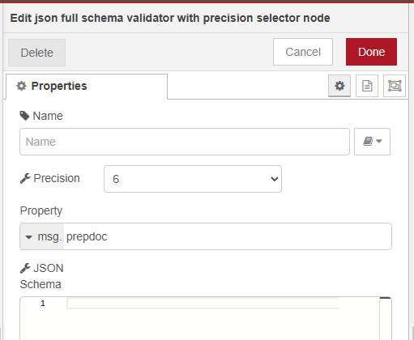
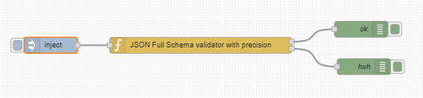

# node-red-contrib-json-full-schema-validator-precision
I needed to be able to control the multipleofprecision option when calling ajv.

Spent a couple of days trying to figure out floating point math, used decimal.js, etc... but still had problems validating schemas.  Then realized it was the validation function itself.

In the end, it was the way ajv does its calculations (no worries with integers), and saw it has a multipleOfPrecision option (https://ajv.js.org/options.html#multipleofprecision) for setting this nicely.

This node simply builds on existing json-schema validate nodes others have worked on, adding the option as a dropdown, and updated packages.

Default is set to 6.

Based on https://www.github.com/oarroyog/node-red-contrib-json-schema
which was based on https://www.github.com/alessh/node-red-contrib-json-schema
which was based on https://www.github.com/chameleonbr/node-red-contrib-json-schema

    JSON Schema validator with multiple of Precision selector
    Send the schema to validate in via msg.payload or set the "Property" name in the options.
    Paste your JSON schema definition in the options, or in incoming msg.schema and node will validate msg.payload. Error is returned on msg.error.
    Select your value for the ajv precision option. This is the number of decimal places to validate for numbers.  Default is set to 6.
    Will output to 1 if all good, or to two if there are issues, adding msg.error with the issues.

# node-red-contrib-json-full-schema-validator
(incoming documentation from forked from here on...)

JSON Full Schema validator for Node Red is pretty easy to use.
Just open node properties and choose which property object wants to validate and paste JSON Schema
- OK will returned in first response
- KO will returned in second response. Error object with explanation will added in msg

**JSON Schema:**

{
  "title": "Person",
  "type": "object",
  "required":["lastName"],
  "properties": {
    "firstName": {
      "type": "string",
      "description": "The person's first name."
    },
    "lastName": {
      "type": "string",
      "description": "The person's last name."
    },
    "age": {
      "description": "Age in years which must be equal to or greater than zero.",
      "type": "integer",
      "minimum": 0
    }
  }
}

Examples:
- OK 
msg.payload= 
{
  "firstName": "John",
  "lastName": "Doe",
  "age": 1
};

- KO
msg.payload= 
{
  "firstName": "John",
  "age": 1
};
